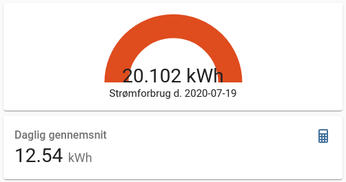

# eloverblik

[](https://github.com/custom-components/hacs)

The `eloverblik`component is a Home Assistant custom component for monitoring your electricity data from eloverblik.dk

*The custom component in it's very early stage for showing data from eloverblik.dk.*

## Installation
---
### Manual Installation
  1. Copy eloverblik folder into your custom_components folder in your hass configuration directory.
  2. Confiure the `eloverblik` sensor.
  3. Restart Home Assistant.

### Installation with HACS (Home Assistant Community Store)
  1. Ensure that [HACS](https://hacs.xyz/) is installed.
  2. Search for and install the `eloverblik` integration.
  3. Confiure the `eloverblik` sensor.
  4. Restart Home Assistant.


## Configuration
---
Fully configurable through config flow.
  1. Head to configuration --> integration
  2. Add new and search for eloverblik
  3. enter refresh token and metering point.

### Refresh token and metering point
Get refresh token and metering point from https://eloverblik.dk.
  1. Login at [eloverblik](https://eloverblik.dk).
  2. metering point is your `ID`
  3. refresh token can be created by clicking at you user and chose share data.

## State and attributes
---
A sensor for each over hour in the past 24 hours is created with the syntax:
 * sensor.eloverblik_energy_0_1
 * sensor.eloverblik_energy_1_2
 * etc.

A sensor which sum up the total energy usage is added as well:
 * sensor.eloverblik_energy_total

All sensors show their value in kWh.

## Debugging
It is possible to debug log the raw response from eloverblik.dk API. This is done by setting up logging like below in configuration.yaml in Home Assistant. It is also possible to set the log level through a service call in UI.  
```
logger: 
  default: info
  logs: 
    pyeloverblik.eloverblik: debug
```

## Examples

### Daily average and gauge bar indicating high usage
Below example is an example how to display daily average and a guage indicating high usage. 




**Requirements**

* Recorder component holding minimum the number of days the average display should cover.
* Lovelace Config Template Card (https://github.com/iantrich/config-template-card)

**Average sensor**

Below statistics sensor shows the daily average calculated over the last 30 days. 
```
sensor:
  - platform: statistics
    entity_id: sensor.eloverblik_energy_total
    name: Eloverblik Monthly Statistics
    sampling_size: 50
    max_age:
        days: 30

```

**Lovelace**

```
type: vertical-stack
cards:
  - card:
      entity: sensor.eloverblik_energy_total
      max: 20
      min: 0
      name: >-
        ${'Strømforbrug d. ' +
        states['sensor.eloverblik_energy_total'].attributes.metering_date }
      severity:
        green: 0
        red: '${states[''sensor.eloverblik_monthly_statistics''].state * 1.25}'
        yellow: '${states[''sensor.eloverblik_monthly_statistics''].state * 1.10}'
      type: gauge
    entities:
      - sensor.eloverblik_energy_total
      - sensor.eloverblik_monthly_statistics
    type: 'custom:config-template-card'
  - type: entity
    entity: sensor.eloverblik_monthly_statistics
    name: Daglig gennemsnit

```
